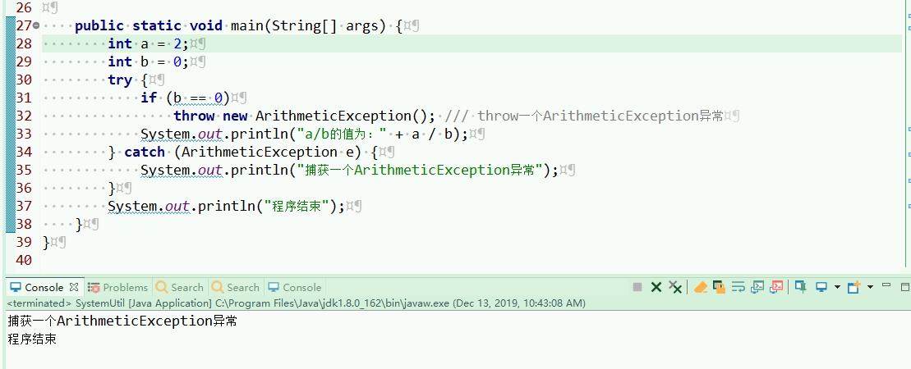
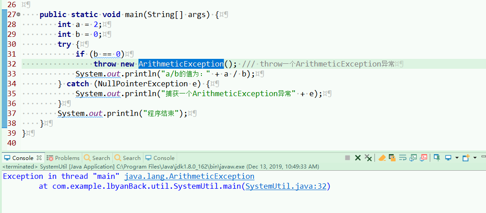

​         java异常是指异常指不期而至的各种状况，如：文件找不到、网络连接失败、非法参数等。异常是一个事件，它发生在程序运行期间，干扰了正常的指令流程。Java通 过API中Throwable类的众多子类描述各种不同的异常。因而，Java异常都是对象，是Throwable子类的实例，描述了出现在一段编码中的 错误条件。当条件生成时，错误将引发异常。


Java异常类层次结构图：


​      项目中经常使用到try-catch-finally来捕获异常，使用方法大致如下~

```java
try {
    // 可能会发生异常的程序代码
} catch (Type1 id1){
    // 捕获并处置try抛出的异常类型Type1
}
catch (Type2 id2){
     //捕获并处置try抛出的异常类型Type2
}
```

​        关键词try后的一对大括号将一块可能发生异常的代码包起来，称为监控区域。Java方法在运行过程中出现异常，则创建异常对象。将异常抛出监控区域之 外，由Java运行时系统试图寻找匹配的catch子句以捕获异常。若有匹配的catch子句，则运行其异常处理代码，try-catch语句结束。

​       匹配的原则是：如果抛出的异常对象属于catch子句的异常类，或者属于该异常类的子类，则认为生成的异常对象与catch块捕获的异常类型相匹配。

```java
// 捕获throw语句抛出的除数为零的异常
    public static void main(String[] args) {
        int a = 2;
        int b = 0;
        try {
            if (b == 0)
                throw new ArithmeticException(); /// throw一个ArithmeticException异常
            System.out.println("a/b的值为：" + a / b);
        } catch (ArithmeticException e) {
            System.out.println("捕获一个ArithmeticException异常");
        }
        System.out.println("程序结束");
    }
```


对于匹配的异常 -- 执行结果



对于不匹配的异常---执行结果



​         通过结果可以看到由于ArithmeticException异常不属于NullPointerException异常，也不是他的子类异常，所以两者不匹配，程序就直接抛异常停止，而不会继续往下执行，而在实际项目开发中经常会遇到不匹配的情况。

​        多个catch时，一旦某个catch捕获到匹配的异常类型，将进入异常处理代码。一经处理结束，就意味着整个try-catch语句结束。其他的catch子句不再有匹配和捕获异常类型的机会。

​       **异常处理中final子句，当在try块或catch块中遇到return语句时，finally语句块将在方法返回之前被执行。在以下4种特殊情况下，finally块不会被执行**

1）在finally语句块中发生了异常。
2）在前面的代码中用了System.exit()退出程序。
3）程序所在的线程死亡。
4）关闭CPU。


#### throw和throws抛出异常

throws抛出异常--

​        当一个方法有可能会出现一些异常，但是没有能力去处理这种异常，可以在方法声明处使用throws子句来抛出异常信息。如果一个方法声明抛出的是Exception异常类型，则该方法被声明抛出所有异常，多个异常使用逗号分隔。

```java
methodname throws Exception1,Exception2,..,ExceptionN
{
}
```

​         方法名后的throws Exception1,Exception2,...,ExceptionN 为声明要抛出的异常列表。当方法抛出异常列表的异常时，方法将不对这些类型及其子类类型的异常作处理，而抛向调用该方法的方法，由他去处理。

```java
public class TestException {
	static void getException() throws NegativeArraySizeException {
		// 定义方法并抛出NegativeArraySizeException异常
		int[] arr = new int[-3]; // 创建数组
	}
 
	public static void main(String[] args) { // 主方法
		try { // try语句处理异常信息
			getException(); // 调用getException()方法
		} catch (NegativeArraySizeException e) {
			System.out.println("pop()方法抛出的异常");// 输出异常信息
		}
	}
 
}
```

使用throws关键字将异常抛给调用者后，如果调用者不想处理该异常，可以继续向上抛出，但最终要有能够处理该异常的调用者。

 方法执行结果就是 getException方法没有处理异常NegativeArraySizeException，而是由main函数来处理。


 判断一个方法可能会出现异常的依据如下：
     1）方法中有throw语句。
     2）调用了其他方法，其他方法用throws子句声明抛出某种异常。


#### 使用throw抛出异常

​        throw总是出现在函数体中，用来抛出一个Throwable类型的异常。程序会在throw语句后立即终止，它后面的语句执行不到，然后在包含它的所有try块中（可能在上层调用函数中）从里向外寻找含有与其匹配的catch子句的try块，throw 抛出的只能够是可抛出类Throwable 或者其子类的实例对象